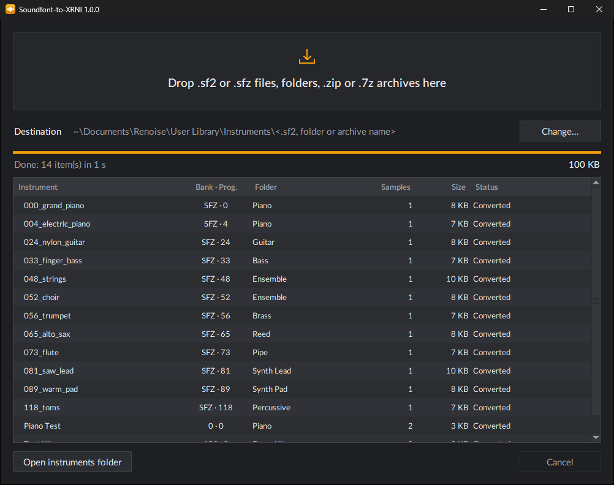

<p align="center"></p>

<h1 align="center">Soundfont-to-XRNI</h1>

<p align="center">Convert SoundFont 2 (<code>.sf2</code>) and SFZ (<code>.sfz</code>) instruments into
<a href="https://www.renoise.com/">Renoise</a> instruments (<code>.xrni</code>) — drag, drop, done.</p>

<p align="center"></p>

## Features

- **SF2 and SFZ**: every SF2 preset and every `.sfz` file becomes a Renoise instrument.
- **Drag and drop**: files, folders, `.zip` and `.7z` archives (unpacked automatically), several at once.
- **Straight into Renoise**: instruments land in your Renoise *User Library*, so they show up in
  Renoise's browser right away.
- **Sorted for you**: General MIDI family folders (Piano, Guitar, Bass, Strings… Drum Kits).
- **Lossless**: samples are stored as FLAC, as Renoise does itself.
- **Fast**: one worker process per CPU thread — a 850 MB SoundFont with 1,785 presets converts in about
  two minutes (disk speed is the limit).
- **Safe re-runs**: converting again replaces the earlier output and never touches files you added.

## Download

Get `Soundfont-to-XRNI-<version>-windows-x64.zip` from the
[**Releases**](../../releases/latest) page, unzip it anywhere and run `Soundfont-to-XRNI.exe`.
No installation needed. Windows 10 or 11 (64-bit).

> Windows SmartScreen may warn about an unrecognised app the first time, because the executable
> is not code-signed: click **More info → Run anyway**.

## Usage

1. Start `Soundfont-to-XRNI.exe`.
2. Drop `.sf2` / `.sfz` files, folders or `.zip` / `.7z` archives on the window (or on the `.exe`
   icon, or click the drop zone to browse).
3. Open Renoise: the instruments are under **User Library → Instruments → *name***.

Output layout (default destination: `Documents\Renoise\User Library\Instruments`, changeable with
**Change…**):

```
Instruments\
└── <SF2 name, or SFZ folder / archive name>\
    ├── 01 Piano\
    │   ├── B000-P000 Grand Piano.xrni      ← SF2: "B<bank>-P<program> <preset>"
    │   └── 000_piano.xrni                  ← SFZ: the .sfz file name
    ├── 05 Bass\ …
    ├── 17 Drum Kits\ …
    └── Samples\                            ← audio files no instrument uses, copied as they are
```

### Folders

`01 Piano`, `02 Chromatic Percussion`, `03 Organ`, `04 Guitar`, `05 Bass`, `06 Strings`,
`07 Ensemble`, `08 Brass`, `09 Reed`, `10 Pipe`, `11 Synth Lead`, `12 Synth Pad`, `13 Synth Effects`,
`14 Ethnic`, `15 Percussive`, `16 Sound Effects`, `17 Drum Kits` and, only for an `.sfz` with no
program number and an unrecognised name, `18 Other`.

Instruments are sorted by **name first** (Piano, Choir, Bass, Trumpet, Snare…), then by their
**General MIDI program number**. When the GM family fits the name, it wins — so a GM-conformant bank
keeps its GM layout and only misnumbered presets move (for example MT-32 / CM-64 banks, or the XG
sound-effects bank 64). SF2 bank 128 always goes to *Drum Kits*. For SFZ, a numeric file-name prefix
is read as the program number (`033_fbass.sfz` → 33 → *Bass*), and an SFZ that maps fixed,
non-pitched sounds across the keyboard is treated as a drum kit.

## What gets converted

| | SF2 | SFZ |
|---|---|---|
| Key and velocity zones, root key, tuning | ✓ | ✓ (note names such as `c#4` too) |
| Loops (continuous, until release) | ✓ | ✓ (read from the WAV `smpl` chunk if the `.sfz` has none) |
| Volume, panning | ✓ | ✓ |
| Volume envelope → Renoise AHDSR | ✓ | ✓ (`ampeg_*`) |
| Exclusive classes / choke groups → mute groups | ✓ | ✓ (`group` / `off_by`) |
| Stereo | L/R pairs merged into stereo samples | stereo files kept |
| Release triggers → Note-Off layer | — | ✓ (`trigger=release`) |
| Round robin → keyzone *Cycle* / *Random* | — | ✓ (`seq_length`, `lorand`/`hirand`) |
| `#define`, `#include`, `default_path`, `offset`/`end`, `one_shot` | — | ✓ |

Not converted: filters, LFOs / vibrato, modulators and MIDI CC routing (Renoise has no direct
equivalent per sample), and chorus / reverb sends (they are not stored in the files). Envelope
curves are approximations.

## Command line

```
Soundfont-to-XRNI.exe --cli PATH... [--library DIR]
```

Converts without opening the window. `PATH`: files, folders or archives; `DIR`: Renoise library
`Instruments` folder.

## Run or build from source

Requires Python 3.12+ on Windows.

```
py -m pip install -r requirements.txt
py -m soundfont_to_xrni                 # the window
py -m unittest discover -s tests -v     # tests (they generate their own small SF2 / SFZ files)

py -m pip install -r requirements-build.txt
py build.py                             # dist\Soundfont-to-XRNI.exe + release .zip
```

Pushing a version tag (`v1.2.3`) makes GitHub Actions run the tests, build the `.exe` and attach
it to the release (see `.github/workflows/build.yml`).

## Notes

- Please only convert SoundFonts you are allowed to use; most sample libraries have their own licence.
- Renoise is a trademark of its respective owners. This project is not affiliated with or endorsed by Renoise.
- Renoise AHDSR times follow `seconds = 60 × value³`, as documented on the
  [Renoise forum](https://forum.renoise.com/t/manipulating-an-ahdsrs-time-based-parameters-from-lua/78564).

## Licence

[MIT](LICENSE)
